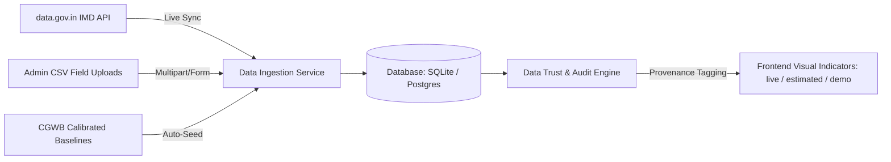

# JalRakshak AI (જળરક્ષક AI)

<p align="center">
  
  
  
  
  
  
  
  
</p>

<h3 align="center">
  Intelligent Drought & Groundwater Depletion Advisory Platform for Saurashtra
</h3>

<p align="center">
  <em>Transforming raw hydrogeological and meteorological data into deterministic, explainable, and culturally relevant water action.</em>
</p>

---

## 📌 Table of Contents

- [Executive Summary](#-executive-summary)
- [The Saurashtra Water Challenge](#-the-saurashtra-water-challenge)
- [Core Architecture & AI Paradigm](#-core-architecture--ai-paradigm)
- [Multi-Agent System Specification](#-multi-agent-system-specification)
- [Data Authenticity & Ingestion Pipeline](#-data-authenticity--ingestion-pipeline)
- [Key Features & User Portals](#-key-features--user-portals)
- [Technology Stack](#-technology-stack)
- [Project Directory Structure](#-project-directory-structure)
- [Quick Start Guide](#-quick-start-guide)
  - [Prerequisites](#prerequisites)
  - [Environment Configuration](#environment-configuration)
  - [Backend Setup](#backend-setup)
  - [Frontend Setup](#frontend-setup)
  - [Demo Accounts & Credentials](#demo-accounts--credentials)
- [API Reference](#-api-reference)
- [Docker & Containerized Deployment](#-docker--containerized-deployment)
- [Automated Testing & Quality Assurance](#-automated-testing--quality-assurance)
- [Security & Governance](#-security--governance)
- [Product Roadmap](#-product-roadmap)
- [Trust, Safety & Limitations](#-trust-safety--limitations)
- [License & Acknowledgments](#-license--acknowledgments)

---

## 🌊 Executive Summary

**JalRakshak AI** is an enterprise-grade, agentic decision-support ecosystem designed to combat severe groundwater depletion and recurring meteorological droughts across the **11 districts of Saurashtra, Gujarat, India** (Rajkot, Junagadh, Amreli, Jamnagar, Bhavnagar, Surendranagar, Morbi, Botad, Porbandar, Gir Somnath, and Devbhoomi Dwarka).

By coupling **deterministic hydrological algorithms** (eliminating numerical hallucination) with **IBM Granite 4 H Small on watsonx.ai** (enabling natural-language reasoning and Gujarati translation), JalRakshak AI translates complex aquifer metrics into clear, role-specific guidance for:
1. **Smallholder Farmers**: Hyper-local crop-switching advisories, sowing risk assessments, and water-saving irrigation techniques.
2. **Gram Panchayats & Water Committees**: Village-level supply-demand balance sheets, prioritized recharge structure planning, and automated Gram Sabha reports.
3. **District & State Administrators**: Regional GIS vulnerability mapping, emergency tanker routing priorities, real-time telemetry alerts, and live OGD data ingestion.

---

## ⚠️ The Saurashtra Water Challenge

The Saurashtra peninsula presents unique hydrogeological vulnerabilities:
* **Hard-Rock Basalt Aquifers**: Poor natural recharge capacity with low storativity, leading to rapid water-table drops (0.5m to 1.5m per annum) during dry spells.
* **Agricultural Over-Draft**: Intensive cultivation of water-demanding cash crops (such as Bt Cotton and Summer Groundnut) driving extraction beyond sustainable limits.
* **Erratic Southwest Monsoons**: Skewed precipitation distribution resulting in prolonged dry spells even in years with normal aggregate rainfall.
* **Data-to-Action Bottleneck**: Existing government repositories (such as India-WRIS or CGWB bulletins) deliver raw hydrographs and piezometric tables that are inaccessible to non-technical grassroots stakeholders.

---

## 🏗️ Core Architecture & AI Paradigm

JalRakshak AI enforces a **strict decoupling** between mathematical calculation and natural-language communication:

```
┌─────────────────────────────────────────────────────────────────────────┐
│                          DATA INGESTION LAYER                           │
│   • Open Government Data (data.gov.in API) for IMD District Rainfall    │
│   • CGWB Baseline Hydrogeology Profiles & Piezometer Depth Series       │
│   • Admin Field Survey CSV Ingestion & Local Government Directory (LGD) │
└────────────────────────────────────┬────────────────────────────────────┘
                                     ▼
┌─────────────────────────────────────────────────────────────────────────┐
│                         DUAL PERSISTENCE LAYER                          │
│     SQLite (Zero-config local development) | PostgreSQL (Production)    │
└────────────────────────────────────┬────────────────────────────────────┘
                                     ▼
┌─────────────────────────────────────────────────────────────────────────┐
│                 DETERMINISTIC AGENT ORCHESTRATOR                        │
│          Zero-Hallucination Hydrological & Mathematical Engine          │
│                                                                         │
│  ┌──────────────────┐  ┌──────────────────┐  ┌───────────────────────┐  │
│  │ Groundwater Mon. │  │ Drought Warning  │  │ Crop Advisory Agent   │  │
│  └──────────────────┘  └──────────────────┘  └───────────────────────┘  │
│  ┌──────────────────┐  ┌──────────────────┐  ┌───────────────────────┐  │
│  │ Recharge Planner │  │ Water Health     │  │ Water Budget Agent    │  │
│  └──────────────────┘  └──────────────────┘  └───────────────────────┘  │
│  ┌──────────────────┐  ┌──────────────────┐  ┌───────────────────────┐  │
│  │ Community Ranker │  │ What-If Simulator│  │ Action Plan Generator │  │
│  └──────────────────┘  └──────────────────┘  └───────────────────────┘  │
└────────────────────────────────────┬────────────────────────────────────┘
                                     ▼
┌─────────────────────────────────────────────────────────────────────────┐
│                  IBM GRANITE 4 H SMALL (watsonx.ai)                     │
│      Natural Language Synthesis • Contextual Reasoning • Gujarati       │
│      (Automatic fallback to deterministic templates in Demo Mode)       │
└────────────────────────────────────┬────────────────────────────────────┘
                                     ▼
┌─────────────────────────────────────────────────────────────────────────┐
│                        USER PRESENTATION LAYER                          │
│   Farmer Portal (Bilingual) • Gram Panchayat Reports • Admin Command    │
└─────────────────────────────────────────────────────────────────────────┘
```

### The 6-Part Explainable AI Contract
Every advisory generated by the system adheres to a structured, audit-ready schema:
* **WHAT**: Direct assessment of current water and risk conditions.
* **WHY**: Hydrological root-cause analysis (e.g., rainfall deficiency vs. agricultural over-draft).
* **DATA USED**: Explicit metrics, time-series windows, and data tiers consulted.
* **CONFIDENCE**: Reliability score based on provenance freshness and verification status.
* **NEXT ACTION**: Concrete, high-impact remedial steps for the user.
* **LIMITATIONS**: Engineering, agronomic, and survey disclaimers.

---

## 🤖 Multi-Agent System Specification

| Agent | Responsibility | Core Metrics & Outputs |
| :--- | :--- | :--- |
| **Groundwater Monitoring Agent** | Analyzes multi-year depth trends, seasonal fluctuations, and overdraft trajectories. | Depth (mbgl), 5-year trend slope (m/yr), depletion severity (`Normal`, `Moderate`, `Severe`, `Critical`). |
| **Drought Early Warning Agent** | Combines rainfall deficits, water-table anomalies, and extraction stress. | Drought Risk Index (0–100), alert categorization (`Low`, `Alert`, `Severe Drought`). |
| **Water Health Agent** | Evaluates a composite sustainability index across 5 hydrogeological pillars. | Water Health Score (0–100), letter grade (A+ through F), sustainability category. |
| **Water Budget Agent** | Balances total available storage against domestic, agricultural, and industrial demand. | Sector breakdown, net balance (Surplus / Deficit in MCM), domestic security window. |
| **Crop Advisory Agent** | Evaluates crop water footprints against local water budgets; suggests resilient substitutes. | Recommended crops (e.g., Bajra, Sesame, Castor), water savings vs. Cotton (%), yield risk rating. |
| **Recharge Structure Agent** | Recommends site-specific artificial recharge structures based on terrain and aquifer geology. | Structure types (Check dams, farm ponds, percolation pits), recharge potential (MCM), estimated cost. |
| **Scenario / Impact Agent** | Simulates deterministic counterfactuals (e.g., rainfall drop, drip irrigation adoption). | Projected water table delta, revised drought index, economic impact. |
| **Community Priority Agent** | Ranks regional villages by vulnerability to prioritize emergency relief and funding. | Urgency index, vulnerability score, priority tier, recommended relief allocations. |
| **Agent Orchestrator** | Coordinates parallel agent execution, synthesizes context, and queries IBM Granite. | Unified village intelligence dossier and complete execution audit trace. |

---

## 📊 Data Authenticity & Ingestion Pipeline

JalRakshak AI features a transparent, hybrid data strategy with strict provenance auditing.



### Data Provenance Flags
Every record stored in the database is stamped with an explicit `data_source` tag:
* `live`: Verified data ingested directly from government APIs (e.g., `data.gov.in`) or authenticated field officer CSV uploads.
* `estimated`: Mathematically interpolated village values mapped from nearest district CGWB hydrogeological benchmarks and LGD codes.
* `demo`: Statistically calibrated baseline models reflecting published Saurashtra seasonal profiles.

---

## 💻 Key Features & User Portals

### 1. 🌾 Farmer Portal (`/farmer/dashboard`)
- **Bilingual Experience**: Full English and Gujarati (`ગુજરાતી`) localization.
- **Smart Crop Advisory**: Tailored recommendations comparing water footprints (e.g., switching from Cotton to Pearl Millet saves 62% water).
- **Interactive Water Copilot**: Natural-language conversational interface powered by IBM Granite.
- **Simple Action Cards**: Jargon-free action items indicating water health and sowing advisories.

### 2. 🏛️ Community & Gram Panchayat Portal (`/community-priority`, `/reports`)
- **Village Water Budget Balance Sheet**: Visual ledger of water supply vs. demand in Million Cubic Metres (MCM).
- **Recharge Site Planner**: Geospatial identification of optimal check dams, farm ponds, and percolation tanks.
- **Automated Gram Sabha PDF Reports**: One-click generation of printable water health scorecards for public display.

### 3. 🛡️ Administrator Command Center (`/admin/dashboard`)
- **Interactive Hydro Atlas**: Full-screen GIS map of all 11 Saurashtra districts with color-coded risk markers.
- **Live Early Warning Feeds**: Threshold-triggered alerts for over-drafted aquifers and delayed monsoon impacts.
- **Data Source & Ingestion Hub**: Real-time management of `data.gov.in` API syncs and manual CSV dataset uploads.
- **Agent Execution Trace Inspector**: Granular audit log showing exact intermediate values calculated by each agent.

---

## 🛠️ Technology Stack

```
JalRakshak AI
├── AI & Intelligence
│   ├── IBM Granite 4 H Small (ibm/granite-4-h-small)
│   ├── IBM watsonx.ai REST / SDK
│   └── Deterministic Python Hydrological Models
├── Backend Engine
│   ├── Python 3.10+
│   ├── FastAPI & Starlette
│   ├── Pydantic v2 (Strict Schema Validation)
│   ├── SQLite3 (WAL Mode) & PostgreSQL (psycopg)
│   ├── PyJWT & Passlib (bcrypt Authentication)
│   ├── SlowAPI (Rate Limiting)
│   └── HTTPX (Async Government API Ingestion)
└── Frontend Application
    ├── React 19 & TypeScript
    ├── Vite (Fast Build Tooling)
    ├── TailwindCSS & CSS Design Tokens
    ├── Recharts (Hydrological Visualizations)
    ├── Leaflet & React Leaflet (Interactive Maps)
    ├── Framer Motion (Micro-animations)
    └── Lucide Icons
```

---

## 📁 Project Directory Structure

```
jalrakshak-ai/
├── backend/
│   ├── app/
│   │   ├── agents/                 # 8 deterministic agents + orchestrator
│   │   │   ├── community_agent.py
│   │   │   ├── crop_agent.py
│   │   │   ├── drought_agent.py
│   │   │   ├── groundwater_agent.py
│   │   │   ├── orchestrator.py
│   │   │   ├── recharge_agent.py
│   │   │   ├── scenario_agent.py
│   │   │   ├── water_budget_agent.py
│   │   │   └── water_health_agent.py
│   │   ├── api/                    # REST API routers
│   │   │   ├── auth_router.py      # JWT authentication & login
│   │   │   ├── data_router.py      # CSV uploads & DB maintenance
│   │   │   ├── ingestion_router.py # data.gov.in live sync
│   │   │   ├── routes.py           # Core agent & analytical routes
│   │   │   ├── user_router.py      # Farmer profiles & user management
│   │   │   └── whatsapp_router.py  # Twilio WhatsApp webhook channel
│   │   ├── core/                   # Security, JWT, hashing, app config
│   │   ├── schemas/                # Pydantic request & response models
│   │   └── services/               # Database DAL, Granite service, Ingestion
│   │       ├── database.py         # Dual-engine SQLite / Postgres DAL
│   │       ├── data_service.py     # Analytics & statistics aggregation
│   │       ├── granite_service.py  # IBM watsonx.ai client & prompt templates
│   │       ├── scheduler.py        # Automated sync & maintenance
│   │       └── ingestion/          # data.gov.in OGD connector
│   ├── tests/                      # Automated Pytest test suite (35+ tests)
│   ├── main.py                     # FastAPI application factory
│   └── requirements.txt            # Python dependencies
├── frontend/
│   ├── src/
│   │   ├── components/             # Reusable UI components (Admin, Farmer, Common)
│   │   ├── context/                # AuthContext, AdminAuthContext, LanguageContext
│   │   ├── pages/                  # Top-level views (Hydro Atlas, Copilot, Admin, etc.)
│   │   │   ├── admin/              # Command Center, Alerts, DataSources, Users
│   │   │   ├── community/          # Community Reports & Priorities
│   │   │   └── farmer/             # Farmer Dashboard & Auth
│   │   ├── services/               # Axios API clients & typed interfaces
│   │   ├── App.tsx                 # Routing & global providers
│   │   └── main.tsx                # Application mount point
│   ├── index.html
│   ├── package.json
│   └── vite.config.ts
├── data/                           # Seed datasets (Villages, Groundwater, Rainfall, Crops)
├── docker-compose.yml              # Multi-container orchestration
├── Dockerfile.backend              # Backend container build
├── Dockerfile.frontend             # Frontend container build
├── .env-example                    # Environment variable template
└── README.md                       # Comprehensive project documentation
```

---

## 🚀 Quick Start Guide

### Prerequisites
* **Python**: `3.10` or higher
* **Node.js**: `18.0` or higher (with `npm`)
* **Git**

---

### Environment Configuration

Create a `.env` file in the project root:

```bash
# Copy the environment template
cp .env-example .env
```

#### Core Configuration Variables

| Variable | Description | Default / Example |
| :--- | :--- | :--- |
| `ADMIN_USERNAME` | Administrator login username | `admin` |
| `ADMIN_PASSWORD` | Administrator login password | `admin@123` |
| `WATSONX_API_KEY` | IBM watsonx API Key | *(Leave empty to use automatic Demo Mode)* |
| `WATSONX_PROJECT_ID` | IBM watsonx Project ID | *(Optional)* |
| `WATSONX_URL` | IBM Cloud watsonx endpoint URL | `https://us-south.ml.cloud.ibm.com` |
| `WATSONX_MODEL_ID` | IBM Granite Model Identifier | `ibm/granite-4-h-small` |
| `DEMO_MODE` | Force deterministic fallback advisories | `false` |
| `DATA_GOV_API_KEY` | Open Government Data (data.gov.in) key | *(Optional; for live rainfall sync)* |
| `DATABASE_URL` | PostgreSQL connection string | *(Optional; defaults to SQLite if omitted)* |

---

### Backend Setup

```bash
# 1. Navigate to backend directory
cd backend

# 2. Create and activate a virtual environment (recommended)
python -m venv .venv
# On Windows:
.venv\Scripts\activate
# On Linux/macOS:
source .venv/bin/activate

# 3. Install dependencies
pip install -r requirements.txt

# 4. Start the development server
python -m uvicorn main:app --host 127.0.0.1 --port 8001 --reload
```

* **API Health Check**: [http://localhost:8001/api/v1/health](http://localhost:8001/api/v1/health)
* **Interactive Swagger UI**: [http://localhost:8001/docs](http://localhost:8001/docs)
* **ReDoc Documentation**: [http://localhost:8001/redoc](http://localhost:8001/redoc)

---

### Frontend Setup

```bash
# 1. Open a new terminal and navigate to frontend directory
cd frontend

# 2. Install npm dependencies
npm install

# 3. Start the Vite development server
npm run dev
```

* **Frontend Web Application**: [http://localhost:5173](http://localhost:5173)

---

### Demo Accounts & Credentials

| Role | Login URL | Username / Email | Password |
| :--- | :--- | :--- | :--- |
| **System Administrator** | `/admin/login` | `admin` | `admin@123` *(or `jalrakshak2024`)* |
| **Registered Farmer** | `/farmer/login` | `ramesh@example.com` | `farmer123` |

---

## 📡 API Reference

All backend routes are versioned under the `/api/v1` prefix.

| Method | Endpoint | Description | Auth Required |
| :--- | :--- | :--- | :---: |
| `GET` | `/health` | System health check & watsonx status | No |
| `POST` | `/auth/login` | Admin & User JWT login | No |
| `GET` | `/villages` | List all monitored Saurashtra villages | No |
| `GET` | `/villages/{id}` | Retrieve village metadata and profile | No |
| `GET` | `/villages/{id}/groundwater` | Multi-year groundwater depth series & trend | No |
| `GET` | `/villages/{id}/rainfall` | Monthly rainfall historical records & deficit | No |
| `GET` | `/villages/{id}/risk` | Multi-factor drought risk assessment | No |
| `GET` | `/villages/{id}/water-health` | Composite Water Health Score breakdown | No |
| `GET` | `/villages/{id}/water-budget` | Supply vs. demand balance sheet (MCM) | No |
| `GET` | `/villages/{id}/analysis` | Complete 8-agent dossier + trace log | No |
| `GET` | `/community-priority` | Urgency-ranked village prioritization | No |
| `POST` | `/crop-advice` | Water-efficient crop recommendations | No |
| `POST` | `/recharge-advice` | Optimal recharge structure recommendations | No |
| `POST` | `/scenario` | Deterministic what-if counterfactual simulation | No |
| `POST` | `/copilot` | Natural-language query to IBM Granite *(Rate-limited)* | No |
| `POST` | `/reports` | Generate structured water summary report | No |
| `POST` | `/action-plan` | Generate prioritized water action roadmap | No |
| `GET` | `/agent-trace/{id}` | Inspect execution trace of an analysis run | No |
| `GET` | `/data/status` | Ingestion status & live vs. demo row counts | No |
| `POST` | `/data/upload/{table}` | Upload and merge field survey CSV | **Yes (Admin JWT)** |
| `POST` | `/data/ingest/data-gov` | Trigger live IMD rainfall fetch from data.gov.in | **Yes (Admin JWT)** |
| `POST` | `/whatsapp/webhook` | Twilio WhatsApp incoming webhook handler | No |

---

## 🐳 Docker & Containerized Deployment

Run the complete multi-tier application stack with a single command:

```bash
# Build and start both backend (8001) and frontend (3000)
docker-compose up --build
```

### Accessing Docker Services
* **Frontend Application**: `http://localhost:3000`
* **Backend API**: `http://localhost:8001`
* **Swagger API Docs**: `http://localhost:8001/docs`

---

## 🧪 Automated Testing & Quality Assurance

The test suite validates data schemas, mathematical determinism, rate limiting, and graceful fallback behavior:

```bash
cd backend
python -m pytest -v
```

### Test Suite Coverage (35 Tests Passing)
* **Agent Calculations**: Verifies that groundwater slopes, drought indices, and water health scores match exact formulas.
* **Granite Fallback / Demo Mode**: Asserts that lack of watsonx credentials automatically falls back to deterministic guidance without error.
* **API Schemas & Contracts**: Validates Pydantic response models across all endpoints.
* **JWT Security**: Confirms unauthenticated calls to admin mutation routes return `HTTP 401 Unauthorized`.
* **Rate Limiting**: Tests that abuse vectors on LLM endpoints trigger `HTTP 429 Too Many Requests`.

---

## 🔒 Security & Governance

* **Zero-Secret Frontend**: All watsonx and government API keys are isolated on the server side and never sent to client browsers.
* **JWT Authentication**: Administrative and protected mutation routes require cryptographically signed Bearer tokens.
* **Bcrypt Password Hashing**: User credentials are stored using industry-standard one-way password hashing.
* **Rate Limiting**: AI and computationally heavy routes are guarded by SlowAPI token-bucket limits to prevent denial-of-service or budget exhaustion.
* **Strict CORS Policy**: Restricted cross-origin resource sharing to prevent unauthorized cross-site requests.

---

## 🗺️ Product Roadmap

### Phase 1: Core Foundation & Intelligence (Completed ✅)
- [x] Full-stack architecture with FastAPI backend and React/TypeScript frontend.
- [x] 8-agent deterministic hydrological calculation engine.
- [x] IBM Granite 4 H Small integration via watsonx.ai with automated Demo Mode fallback.
- [x] Dual-engine SQLite and PostgreSQL persistence layer with auto-seeding.
- [x] Bilingual user interface (English and Gujarati).
- [x] Live `data.gov.in` OGD API connector for district rainfall ingestion.
- [x] Admin Command Center with CSV dataset upload and provenance tracking.
- [x] Twilio WhatsApp webhook integration for conversational advisory.


---

## ⚖️ Trust, Safety & Limitations

> **Disclaimer:** JalRakshak AI is a **decision-support platform** designed to provide advisory recommendations. It is not a replacement for formal hydrogeological surveys, civil engineering assessments, or statutory groundwater regulation.

1. **Engineering Validation**: Artificial recharge structure proposals (check dams, percolation tanks) require on-site geotechnical and topographic validation prior to civil construction.
2. **Agricultural Expertise**: Crop switching recommendations should be corroborated with local Krishi Vigyan Kendras (KVKs) and extension officers.
3. **Data Freshness**: Where live sensor feeds are unavailable, calculations rely on published historical benchmarks and statistical estimations.

---

## 📄 License & Acknowledgments

* **License**: MIT License. See [LICENSE](LICENSE) for details.
* **AI Model**: [IBM Granite 4 H Small](https://huggingface.co/ibm-granite) hosted on [IBM watsonx.ai](https://www.ibm.com/watsonx).
* **Data Sources**: [Open Government Data (OGD) Platform India](https://data.gov.in), [Central Ground Water Board (CGWB)](https://cgwb.gov.in), and [India Meteorological Department (IMD)](https://mausam.imd.gov.in).

<p align="center">
  <strong>JalRakshak AI</strong> — <em>From Water Data to Intelligent Water Action.</em>
</p>
